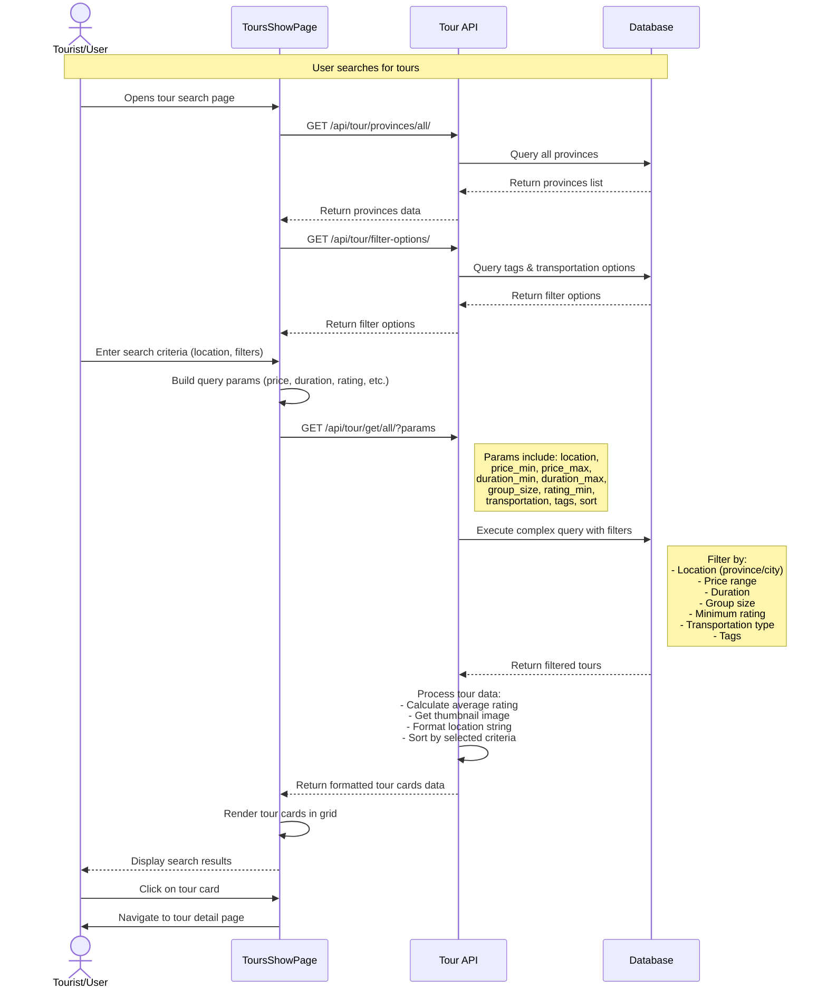
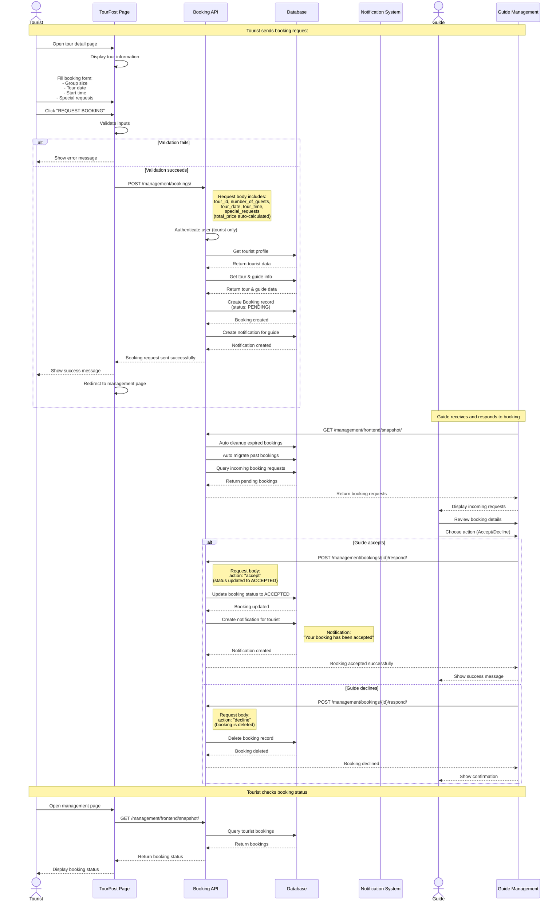
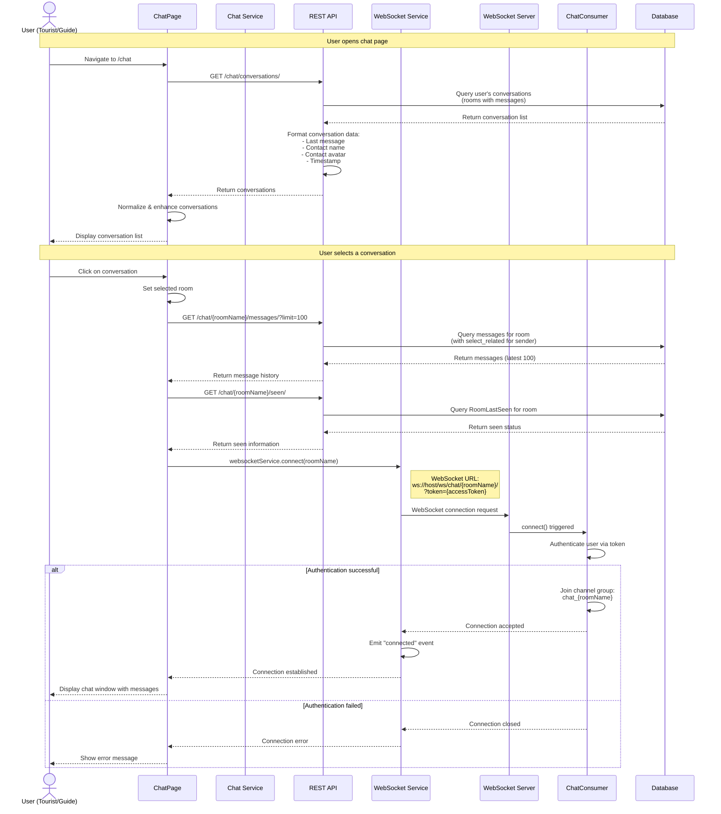
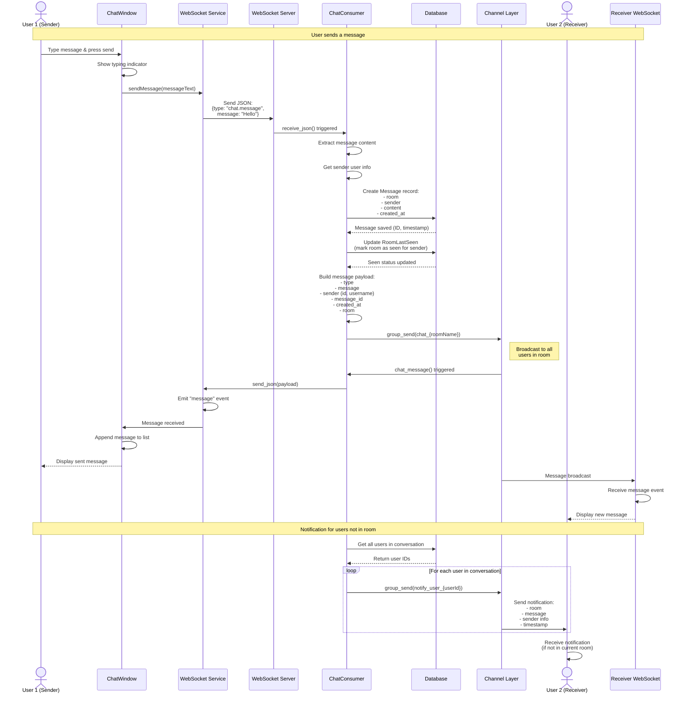
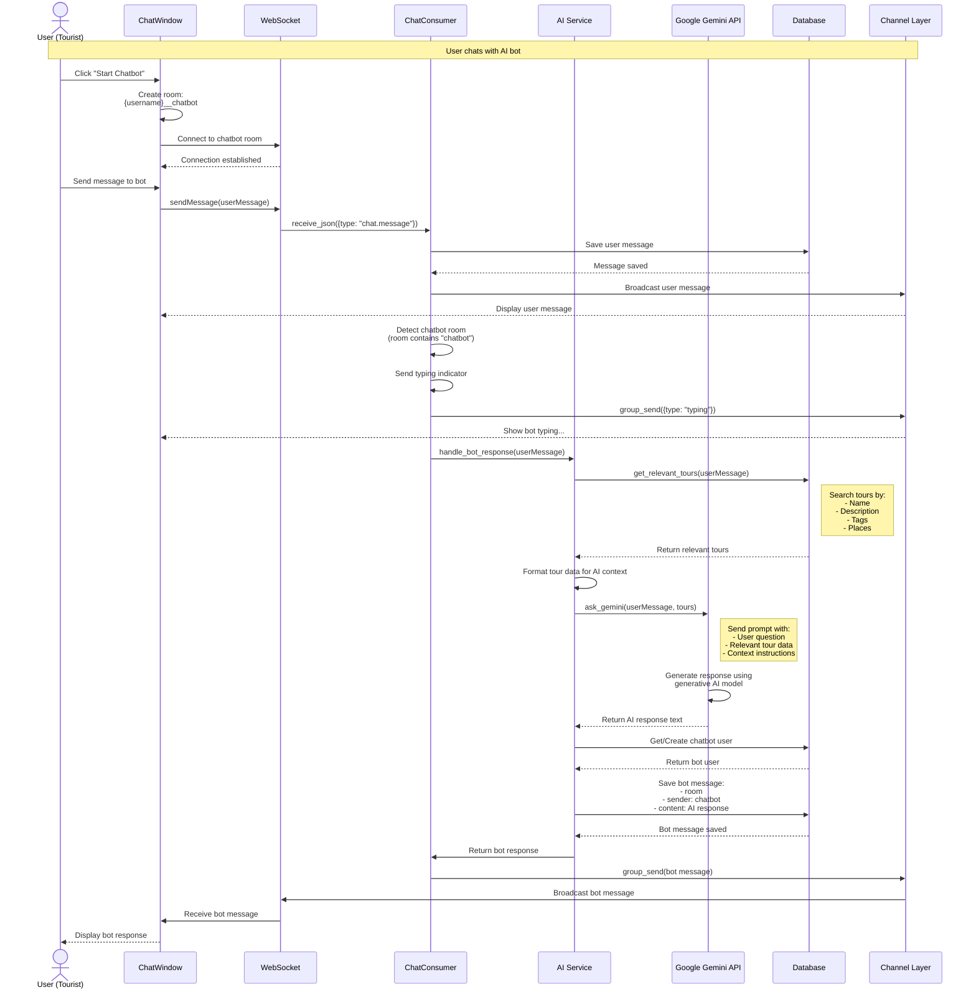
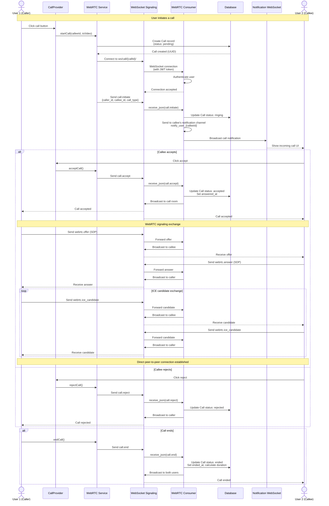

# Sequence Diagrams - VNGO Application

## 1. Search Tour Feature

## 2. Book Tour Feature

## 3. Chat Feature

### 3.1 Chat Initialization & Connection

### 3.2 Sending & Receiving Messages

### 3.3 Chatbot Interaction

## 4. Create Tour Feature

```mermaid
sequenceDiagram
    actor Guide as Guide
    participant TourCreatePage as TourCreate Page
    participant TourService as Tour Service
    participant API as Tour API
    participant DB as Database
    participant Storage as Media Storage

    Note over Guide,Storage: Guide creates a new tour
    Guide->>TourCreatePage: Navigate to /tour/create
    TourCreatePage->>TourCreatePage: Initialize empty form
    TourCreatePage-->>Guide: Display tour creation form

    Note over Guide,TourCreatePage: Fill tour information
    Guide->>TourCreatePage: Enter basic info:<br/>- Tour name<br/>- Duration (hours)<br/>- Min/Max people<br/>- Transportation type<br/>- Meeting location<br/>- Price

    Guide->>TourCreatePage: Add places in order:<br/>- Search place by name<br/>- Add to list<br/>- Drag to reorder
    Note right of TourCreatePage: Places stored with order:<br/>0: First stop<br/>1: Second stop<br/>2: Third stop...

    Guide->>TourCreatePage: Upload images:<br/>- Select multiple images<br/>- Set thumbnail<br/>- Preview images

    Guide->>TourCreatePage: Add metadata:<br/>- Select tags (culture, food, etc.)<br/>- Write description<br/>- Add stop descriptions

    Guide->>TourCreatePage: Click "Create Tour"

    TourCreatePage->>TourCreatePage: Validate form data
    alt Validation fails
        TourCreatePage-->>Guide: Show error message:<br/>"Please fill in all required fields"
    else Validation succeeds
        TourCreatePage->>TourCreatePage: Build FormData:<br/>- Tour fields<br/>- Places JSON array<br/>- Tags JSON array<br/>- Image files<br/>- Thumbnail index

        TourCreatePage->>TourService: createTour(formData)
        TourService->>API: POST /api/tour/post/<br/>Content-Type: multipart/form-data<br/>(requires guide authentication)
        Note right of API: FormData includes:<br/>name, duration, min_people, max_people,<br/>transportation, meeting_location,<br/>price, places (JSON), tags (JSON),<br/>description, stops_descriptions,<br/>thumbnail_idx, images (files)

        API->>API: Authenticate user<br/>(must be guide)

        alt User is not guide
            API-->>TourService: 401 Unauthorized
            TourService-->>TourCreatePage: Error response
            TourCreatePage-->>Guide: "You are not authorized to post tours"
        else User is guide
            API->>DB: Get guide profile
            DB-->>API: Return guide data

            API->>API: Validate serializer data:<br/>- Check required fields<br/>- Validate data types

            alt Serializer validation fails
                API-->>TourService: 400 Bad Request
                TourService-->>TourCreatePage: Validation errors
                TourCreatePage-->>Guide: Display field errors
            else Validation succeeds
                API->>DB: Create Tour record:<br/>- Basic info<br/>- Link to guide<br/>- Initial rating (0, 0)
                DB-->>API: Tour created (ID returned)

                API->>API: Parse and save tags JSON:<br/>["culture", "food", "history"]
                API->>DB: Update tour.tags

                API->>API: Parse and save stops_descriptions JSON:<br/>["Visit first stop...", "Explore second..."]
                API->>DB: Update tour.stops_descriptions

                Note over API,DB: Create places and relationships
                loop For each place in places array
                    API->>DB: Find existing Place by (lat, lon, name)
                    alt Place exists
                        DB-->>API: Return existing Place
                    else Place not found
                        API->>DB: Create new Place:<br/>- lat, lon<br/>- name, name_en<br/>- city, province
                        DB-->>API: Place created
                    end

                    API->>DB: Create TourPlace record:<br/>- tour_id<br/>- place_id<br/>- order (0, 1, 2...)
                    DB-->>API: TourPlace created
                end

                Note over API,Storage: Upload and save images
                loop For each image file
                    API->>Storage: Upload image file
                    Storage-->>API: Image URL

                    API->>DB: Create TourImage record:<br/>- tour_id<br/>- image URL<br/>- isthumbnail (based on thumbnail_idx)
                    DB-->>API: TourImage created
                end

                API->>API: Verify at least 1 image uploaded
                API->>API: Verify exactly 1 thumbnail set

                API-->>TourService: 200 OK<br/>{success: true, tour_id: 123}
                TourService-->>TourCreatePage: Tour created successfully
                TourCreatePage->>TourCreatePage: Show success toast:<br/>"Tour created successfully!"
                TourCreatePage->>TourCreatePage: Redirect to tour detail page
                TourCreatePage-->>Guide: Navigate to /tour/123
            end
        end
    end
```

## 5. WebRTC Call Feature

## Key Components Explained

### Search Tour

- **Frontend**: `ToursShowPage.jsx` handles UI, filters, and API calls
- **Backend**: `Tour/views.py` contains `get_all_tours()` endpoint with complex filtering
- **API Endpoint**: `GET /api/tour/get/all/` with query parameters
- **Database**: SQLite (dev) / PostgreSQL (production) with Django ORM
- **Optimization**: Uses `select_related` and `prefetch_related` for efficient queries

### Book Tour

- **Frontend**: `TourPost.jsx` for booking form, `ManagementTours.jsx` for viewing bookings
- **Backend**:
  - `Management/views.py` contains `BookingViewSet` with CRUD operations
  - `frontend_management_snapshot()` auto-cleans expired bookings
  - Automatic migration of past bookings to `PastTour`
  - `BookingNotification` system for guide/tourist communication
- **API Endpoints**: 
  - `POST /management/bookings/` - Create booking
  - `POST /management/bookings/{id}/respond/` - Accept/Decline
  - `GET /management/frontend/snapshot/` - Get bookings with auto-cleanup
- **Flow**: Tourist → Booking Request (PENDING) → Guide Response (ACCEPT/DECLINE)

### Chat

- **Real-time Communication**: Django Channels with WebSocket
- **Frontend**:
  - `ChatPage.jsx` manages conversations
  - `ChatWindow.jsx` handles message display and sending
  - `websocketService.js` manages WebSocket connections
- **Backend**:
  - `Chat/consumers.py` contains `ChatConsumer` and `NotificationConsumer`
  - `Chat/views.py` for REST API (conversation list, message history, online status)
  - `Chat/ai_service.py` for chatbot AI integration (Google Gemini)
  - `Chat/last_seen.py` for tracking message read status
  - `Chat/models.py` contains `Message`, `RoomLastSeen`, and `Call` models
- **WebSocket Routes**:
  - `ws/chat/{room_name}/` - Chat messages
  - `ws/notify/` - Notifications
  - `ws/call/{call_id}/` - WebRTC signaling
  - `ws/call-notify/` - Call notifications
- **Features**:
  - Real-time messaging with Redis channel layer
  - Typing indicators
  - Message persistence
  - RoomLastSeen tracking for unread messages
  - AI chatbot with tour recommendations
  - WebRTC audio/video calls

### Create Tour

- **Frontend**: `TourCreate.jsx` for tour creation form with:
  - Place search and ordering (drag & drop)
  - Image upload with thumbnail selection
  - Tags selection
  - Stop descriptions editor
- **Backend**: `Tour/views.py` contains `tour_post()` endpoint
- **API Endpoint**: `POST /api/tour/post/` (multipart/form-data)
- **Authentication**: Requires guide role (checked via `user.guide_profile`)
- **Key Features**:
  - FormData with multipart upload for images
  - Ordered places via `TourPlace` junction table (with `order` field)
  - Automatic place creation if not exists (check by lat, lon, name)
  - Image storage with thumbnail designation (`isthumbnail` field)
  - JSON fields for `tags` and `stops_descriptions`
  - Serializer validation for all fields
- **Validation**:
  - Guide-only access (must have `guide_profile`)
  - All required fields must be filled (name, duration, price, etc.)
  - At least 1 image required
  - Exactly 1 thumbnail required (`thumbnail_idx` in form)
  - Places array must not be empty
  - `min_people <= max_people` validation
- **Flow**:
  1. Guide fills form with tour details
  2. Adds places in order (searchable with drag-drop reorder via @dnd-kit)
  3. Uploads images and selects thumbnail (via `ImageUploader` component)
  4. Adds tags (JSON array) and stop descriptions (JSON array)
  5. Submits FormData to backend
  6. Backend validates data via serializer
  7. Backend creates Tour → Places (if new) → TourPlace (with order) → TourImages
  8. Returns success with `tour_id`
  9. Frontend redirects to `/tour/{tour_id}` detail page
