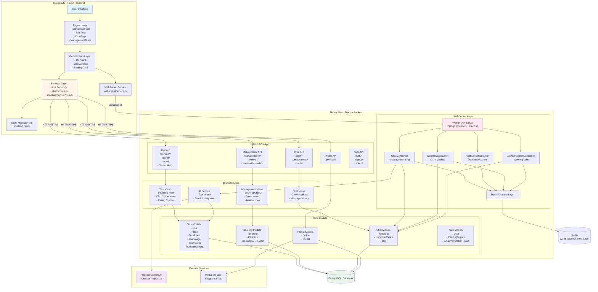

# VNGO System Architecture

## Overall System Architecture



## Data Flow for Each Feature

### 1. Search Tour Data Flow

```mermaid
flowchart LR
    A[User enters search criteria] --> B[ToursShowPage]
    B --> C{Apply Filters}
    C -->|Location| D[Filter by Province/City]
    C -->|Price Range| E[Filter by Price]
    C -->|Duration| F[Filter by Duration]
    C -->|Rating| G[Filter by Rating]
    C -->|Tags| H[Filter by Tags]
    C -->|Transportation| I[Filter by Transport]

    D --> J[GET /api/tour/all/]
    E --> J
    F --> J
    G --> J
    H --> J
    I --> J

    J --> K[Backend Query Processing<br/>get_all_tours()]
    K --> L[Database Query with Filters<br/>(Q objects, select_related)]
    L --> M[Process Results]
    M -->|Calculate average_rating()| N[Format Tour Cards]
    M -->|Get thumbnail image| N
    M -->|Format location string| N
    N --> O[Sort Results<br/>(by rating, price, date)]
    O --> P[Return JSON Response]
    P --> Q[Display Tour Cards]
    Q --> R[User views results]
```

### 2. Book Tour Data Flow

```mermaid
flowchart TD
    A[Tourist on Tour Detail Page] --> B[Fill Booking Form]
    B --> C{Validate Input}
    C -->|Invalid| D[Show Error]
    C -->|Valid| E[POST /management/bookings/]

    E --> F[Authenticate User<br/>(JWT token)]
    F --> G[Get Tourist Profile<br/>(from user.tourist_profile)]
    G --> H[Get Tour & Guide Info<br/>(select_related)]
    H --> I[Create Booking Record<br/>Status: PENDING<br/>(total_price auto-calculated)]
    I --> J[Create BookingNotification<br/>for Guide]
    J --> K[Return Success]
    K --> L[Redirect to Management]

    M[Guide checks Management Page] --> N[GET /management/frontend/snapshot/]
    N --> O[Auto Cleanup Expired Bookings]
    O --> P[Query Pending Bookings]
    P --> Q[Display Incoming Requests]

    Q --> R{Guide Decision}
    R -->|Accept| S[POST .../respond/<br/>action: accept]
    R -->|Decline| T[POST .../respond/<br/>action: decline]

    S --> U[Update Status: ACCEPTED]
    U --> V[Create Notification for Tourist]
    V --> W[Tourist Sees Accepted Booking]

    T --> X[Delete Booking]
    X --> Y[Guide Sees Confirmation]

    style I fill:#c8e6c9
    style U fill:#c8e6c9
    style X fill:#ffcdd2
```

### 3. Chat Data Flow

```mermaid
flowchart TD
    subgraph "Initial Connection"
        A[User Opens Chat Page] --> B[GET /chat/conversations/]
        B --> C[Load Conversation List]
        C --> D[User Selects Conversation]
    end

    subgraph "WebSocket Connection"
        D --> E[WebSocket Connect<br/>ws://host/ws/chat/room/]
        E --> F{Authentication}
        F -->|Success| G[Join Channel Group]
        F -->|Fail| H[Close Connection]
        G --> I[GET /chat/room/messages/]
        I --> J[Load Message History]
        J --> K[Display Chat Window]
    end

    subgraph "Real-time Messaging"
        K --> L[User Types Message]
        L --> M[Send via WebSocket<br/>{type: "chat.message"}]
        M --> N[ChatConsumer receives<br/>(authenticated via token)]
        N --> O[Save Message to Database]
        O --> O2[Update RoomLastSeen<br/>(mark as seen)]
        O2 --> P[Broadcast to Channel Group<br/>chat_{roomName}]
        P --> Q[All Users in Room Receive]
        Q --> R[Update UI<br/>(show message + seen status)]
    end

    subgraph "Chatbot Flow"
        S[User Sends to Chatbot] --> T[Consumer Detects Chatbot]
        T --> U[Show Typing Indicator]
        U --> V[Search Relevant Tours]
        V --> W[Call Gemini API]
        W --> X[Generate AI Response]
        X --> Y[Save Bot Message]
        Y --> Z[Broadcast Bot Response]
        Z --> AA[Display in Chat]
    end

    style G fill:#c8e6c9
    style O fill:#fff9c4
    style X fill:#e1bee7
```

## Technology Stack

### Frontend

- **Framework**: React 19.1.1 with Vite 7.1.7
- **UI Library**:
  - shadcn/ui components (Radix UI)
  - Tailwind CSS 4.1.16 for styling
  - Lucide React icons
- **State Management**: Zustand 5.0.8 (with persist middleware)
- **HTTP Client**: Axios 1.13.1 (with JWT interceptors)
- **WebSocket**: Native WebSocket API (with auto-reconnection)
- **Routing**: React Router 7.9.5
- **Form Validation**: React Hook Form + Zod
- **WebRTC**: Custom hook (useWebRTC.js)

### Backend

- **Framework**: Django 5.2.7
- **API**: Django REST Framework
- **WebSocket**: Django Channels + Daphne (ASGI)
- **Authentication**: JWT (SimpleJWT)
- **AI Integration**: Google Gemini API
- **Token Refresh**: Cookie-based refresh mechanism

### Database & Storage

- **Primary Database**: SQLite (dev) / PostgreSQL (production)
- **Cache & Channel Layer**: Redis (channels-redis)
- **File Storage**: Django Media Storage (local filesystem)
- **ORM**: Django ORM (with select_related/prefetch_related)

### Infrastructure

- **Web Server**: Daphne (ASGI server for Django Channels)
- **Development**: Django development server (HTTP) + Daphne (WebSocket)
- **Deployment**: Can be containerized with Docker

## Security Features

1. **Authentication**

   - JWT-based authentication
   - Token refresh mechanism
   - Protected routes on frontend
   - Permission classes on backend

2. **WebSocket Security**

   - Token-based WS authentication
   - User verification per message
   - Channel group isolation

3. **Data Validation**
   - Frontend form validation
   - Backend serializer validation
   - SQL injection prevention (ORM)
   - XSS protection

## Performance Optimizations

1. **Database**

   - Indexed fields (foreign keys, search fields)
   - Query optimization with select_related/prefetch_related
   - Database connection pooling

2. **Frontend**

   - Memoization (useMemo, useCallback) ✅
   - Image optimization (partial - no lazy loading)
   - Code splitting (not implemented)
   - Lazy loading components (not implemented)

3. **WebSocket**

   - Redis channel layer for scaling ✅
   - Automatic reconnection ✅ (exponential backoff)
   - Token-based authentication ✅
   - User verification per message ✅
   - Channel group isolation ✅

4. **Caching**
   - Redis cache for frequently accessed data ✅ (conversations, online status, room users)
   - Browser cache for static assets (Vite default)
   - API response caching (partial - some endpoints)
