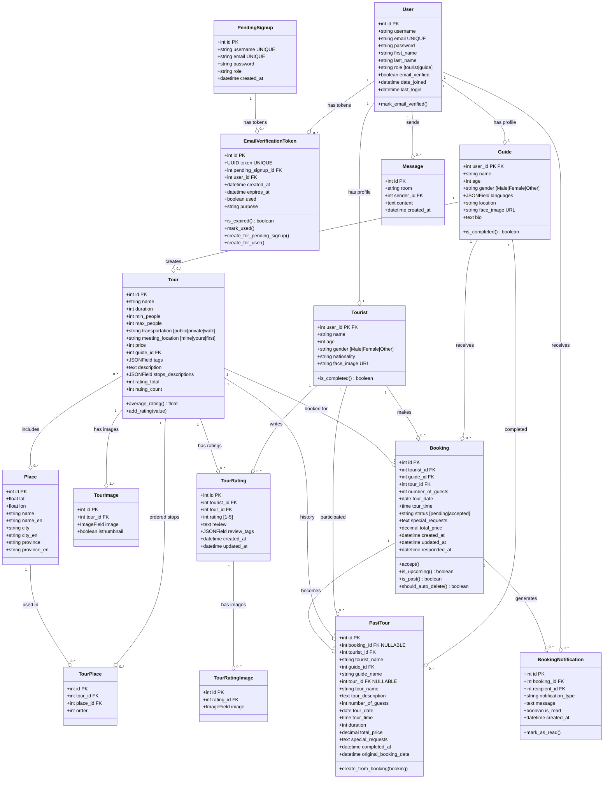
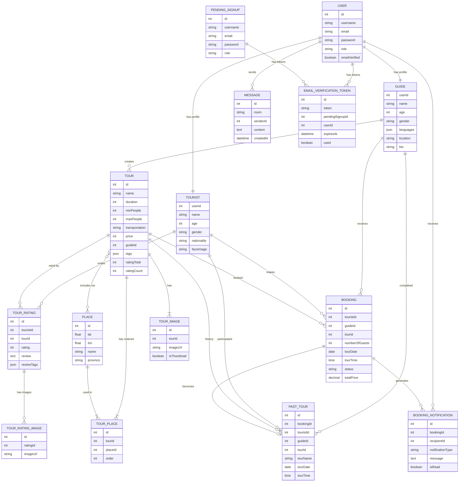

# VNGO Class Diagram

## Complete Class Diagram with Relationships



## Detailed Relationship Explanation

### 1. User Module Relationships

#### User ↔ Tourist/Guide (1:1)
```python
# OneToOneField relationship
User.tourist_profile  # Access tourist profile
User.guide_profile    # Access guide profile
```
- **Cardinality**: 1:1 (One user can have ONE profile - either Tourist OR Guide)
- **Type**: OneToOneField
- **Cascade**: CASCADE (delete profile when user is deleted)

#### User ↔ Message (1:n)
```python
# ForeignKey relationship
User.messages         # All messages sent by user
Message.sender        # User who sent the message
```
- **Cardinality**: 1:n (One user can send MANY messages)
- **Type**: ForeignKey
- **Cascade**: CASCADE

#### User ↔ EmailVerificationToken (1:n)
```python
User.email_verification_tokens  # All tokens for user
EmailVerificationToken.user     # User associated with token
```
- **Cardinality**: 1:n (One user can have MANY verification tokens)
- **Type**: ForeignKey
- **Cascade**: CASCADE

#### User ↔ BookingNotification (1:n)
```python
User.booking_notifications     # All notifications for user
BookingNotification.recipient  # User receiving notification
```
- **Cardinality**: 1:n (One user can receive MANY notifications)
- **Type**: ForeignKey
- **Cascade**: CASCADE

---

### 2. Profile Module Relationships

#### PendingSignup ↔ EmailVerificationToken (1:n)
```python
PendingSignup.verification_tokens       # All tokens for pending signup
EmailVerificationToken.pending_signup   # Pending signup associated with token
```
- **Cardinality**: 1:n (One pending signup can have MANY tokens)
- **Type**: ForeignKey
- **Cascade**: CASCADE

---

### 3. Tour Module Relationships

#### Guide ↔ Tour (1:n)
```python
Guide.tours    # All tours created by guide
Tour.guide     # Guide who created the tour
```
- **Cardinality**: 1:n (One guide can create MANY tours)
- **Type**: ForeignKey
- **Cascade**: CASCADE
- **Business Rule**: Guide must create at least 1 tour to be active

#### Tour ↔ Place (n:n) through TourPlace
```python
Tour.places             # All places in tour
Tour.tour_places        # Ordered junction records
Place.tours             # All tours including this place
TourPlace.tour          # Tour reference
TourPlace.place         # Place reference
TourPlace.order         # Order of place in tour
```
- **Cardinality**: n:n (Many tours can include MANY places)
- **Type**: ManyToManyField with **through** model (TourPlace)
- **Special**: TourPlace adds **order** field for sequence
- **Cascade**: CASCADE on both sides
- **Unique Together**: (tour, place) - prevent duplicate places in same tour

#### Tour ↔ TourImage (1:n)
```python
Tour.tour_images    # All images for tour
TourImage.tour      # Tour associated with image
```
- **Cardinality**: 1:n (One tour has MANY images, at least 1)
- **Type**: ForeignKey
- **Cascade**: CASCADE
- **Business Rule**: 
  - Tour must have at least 1 image
  - Exactly 1 image should have `isthumbnail=True`

#### Tour ↔ TourRating (1:n)
```python
Tour.ratings        # All ratings for tour
TourRating.tour     # Tour being rated
```
- **Cardinality**: 1:n (One tour can have MANY ratings)
- **Type**: ForeignKey
- **Cascade**: CASCADE
- **Unique Together**: (tourist, tour) - one rating per tourist per tour

#### Tourist ↔ TourRating (1:n)
```python
Tourist.tour_ratings    # All ratings by tourist
TourRating.tourist      # Tourist who wrote rating
```
- **Cardinality**: 1:n (One tourist can write MANY ratings)
- **Type**: ForeignKey
- **Cascade**: CASCADE

#### TourRating ↔ TourRatingImage (1:n)
```python
TourRating.images           # All images for rating
TourRatingImage.rating      # Rating associated with image
```
- **Cardinality**: 1:n (One rating can have MANY images)
- **Type**: ForeignKey
- **Cascade**: CASCADE

---

### 4. Management Module Relationships

#### Tourist ↔ Booking (1:n)
```python
Tourist.bookings        # All bookings made by tourist
Booking.tourist         # Tourist who made booking
```
- **Cardinality**: 1:n (One tourist can make MANY bookings)
- **Type**: ForeignKey
- **Cascade**: CASCADE

#### Guide ↔ Booking (1:n)
```python
Guide.received_bookings    # All bookings received by guide
Booking.guide              # Guide receiving booking
```
- **Cardinality**: 1:n (One guide can receive MANY bookings)
- **Type**: ForeignKey
- **Cascade**: CASCADE

#### Tour ↔ Booking (1:n)
```python
Tour.bookings      # All bookings for tour
Booking.tour       # Tour being booked
```
- **Cardinality**: 1:n (One tour can have MANY bookings)
- **Type**: ForeignKey
- **Cascade**: CASCADE

#### Booking ↔ BookingNotification (1:n)
```python
Booking.notifications           # All notifications for booking
BookingNotification.booking     # Booking associated with notification
```
- **Cardinality**: 1:n (One booking generates MANY notifications)
- **Type**: ForeignKey
- **Cascade**: CASCADE
- **Example**: Booking created → notify guide; Booking accepted → notify tourist

#### Booking ↔ PastTour (1:0..1)
```python
Booking.past_tour_records    # Past tour record (if migrated)
PastTour.booking             # Original booking (nullable)
```
- **Cardinality**: 1:0..1 (One booking becomes ZERO or ONE past tour)
- **Type**: ForeignKey
- **Cascade**: SET_NULL (preserve history even if booking deleted)
- **Business Rule**: Only ACCEPTED bookings past their date become PastTours

#### Tourist ↔ PastTour (1:n)
```python
Tourist.past_tours      # All completed tours
PastTour.tourist        # Tourist who participated
```
- **Cardinality**: 1:n (One tourist can complete MANY tours)
- **Type**: ForeignKey
- **Cascade**: CASCADE

#### Guide ↔ PastTour (1:n)
```python
Guide.past_tours    # All tours guided
PastTour.guide      # Guide who led tour
```
- **Cardinality**: 1:n (One guide can complete MANY tours)
- **Type**: ForeignKey
- **Cascade**: CASCADE

#### Tour ↔ PastTour (1:n)
```python
Tour.past_tours     # History of completions
PastTour.tour       # Tour reference (nullable)
```
- **Cardinality**: 1:n (One tour can be completed MANY times)
- **Type**: ForeignKey
- **Cascade**: SET_NULL (preserve history even if tour deleted)

---

### 5. Chat Module Relationships

#### User ↔ Message (1:n)
```python
User.messages      # All messages sent by user
Message.sender     # User who sent message
```
- **Cardinality**: 1:n (One user sends MANY messages)
- **Type**: ForeignKey
- **Cascade**: CASCADE
- **Note**: Room format is `{username1}__{username2}` or `{username}__chatbot`

---

## Cardinality Summary Table

| Relationship | Cardinality | Type | On Delete |
|-------------|-------------|------|-----------|
| User ↔ Tourist | 1:1 | OneToOne | CASCADE |
| User ↔ Guide | 1:1 | OneToOne | CASCADE |
| User ↔ Message | 1:n | ForeignKey | CASCADE |
| User ↔ EmailVerificationToken | 1:n | ForeignKey | CASCADE |
| User ↔ BookingNotification | 1:n | ForeignKey | CASCADE |
| PendingSignup ↔ EmailVerificationToken | 1:n | ForeignKey | CASCADE |
| Guide ↔ Tour | 1:n | ForeignKey | CASCADE |
| Tour ↔ Place | n:n | ManyToMany (through TourPlace) | CASCADE |
| Tour ↔ TourImage | 1:n (≥1) | ForeignKey | CASCADE |
| Tour ↔ TourRating | 1:n | ForeignKey | CASCADE |
| Tour ↔ Booking | 1:n | ForeignKey | CASCADE |
| Tour ↔ PastTour | 1:n | ForeignKey | SET_NULL |
| Tourist ↔ TourRating | 1:n | ForeignKey | CASCADE |
| Tourist ↔ Booking | 1:n | ForeignKey | CASCADE |
| Tourist ↔ PastTour | 1:n | ForeignKey | CASCADE |
| Guide ↔ Booking | 1:n | ForeignKey | CASCADE |
| Guide ↔ PastTour | 1:n | ForeignKey | CASCADE |
| TourRating ↔ TourRatingImage | 1:n | ForeignKey | CASCADE |
| Booking ↔ BookingNotification | 1:n | ForeignKey | CASCADE |
| Booking ↔ PastTour | 1:0..1 | ForeignKey | SET_NULL |

---

## Entity Relationship Diagram (ERD) - Database View



---

## Key Constraints & Business Rules

### Unique Constraints
1. **User**
   - `username` UNIQUE
   - `email` UNIQUE

2. **TourRating**
   - `(tourist, tour)` UNIQUE - One tourist can only rate a tour once

3. **TourPlace**
   - `(tour, place)` UNIQUE - Prevent duplicate places in same tour

4. **EmailVerificationToken**
   - `token` UNIQUE

### Foreign Key Constraints
- Most foreign keys use **CASCADE** delete
- **Exceptions** (use SET_NULL to preserve history):
  - `PastTour.booking` - Keep history even if booking deleted
  - `PastTour.tour` - Keep history even if tour deleted

### Business Logic Constraints
1. **Tour**: Must have at least 1 image
2. **Tour**: Exactly 1 image with `isthumbnail=True`
3. **Tour**: `min_people <= max_people`
4. **Booking**: Only PENDING or ACCEPTED status can exist in DB
5. **Booking**: PENDING bookings auto-deleted after tour date passes
6. **PastTour**: Only created from ACCEPTED bookings after tour date
7. **TourRating**: Tourist can only rate tours they've completed (via PastTour)

---

## Indexes

### Primary Keys
All tables have auto-incrementing `id` as PK, except:
- `Tourist` uses `user_id` as PK (OneToOne)
- `Guide` uses `user_id` as PK (OneToOne)

### Foreign Key Indexes
Automatically indexed:
- `Tour.guide_id`
- `Booking.tourist_id`, `Booking.guide_id`, `Booking.tour_id`
- `Message.sender_id`
- etc.

### Custom Composite Indexes
1. **Booking**: `(tourist, status)`, `(guide, status)`, `(tour_date, status)`
2. **BookingNotification**: `(recipient, is_read)`
3. **PastTour**: `(tourist, tour_date)`, `(guide, tour_date)`

---

**Last Updated**: November 30, 2025  
**Database**: PostgreSQL with Django ORM  
**Version**: 1.0.0

