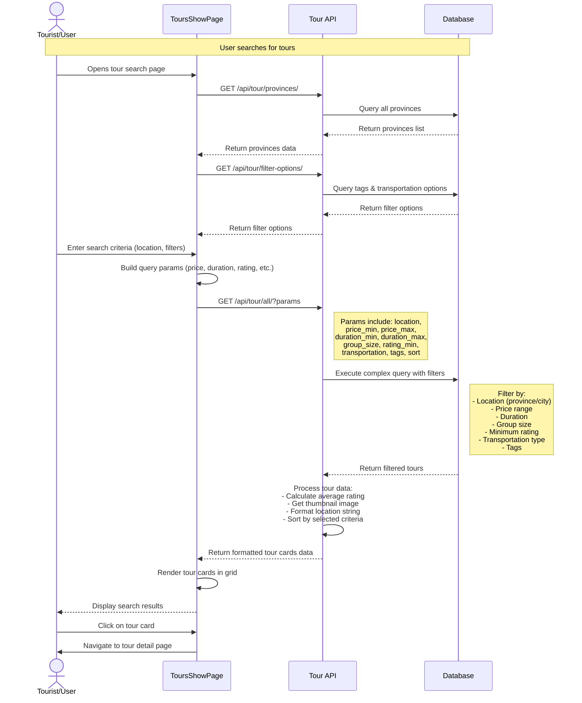
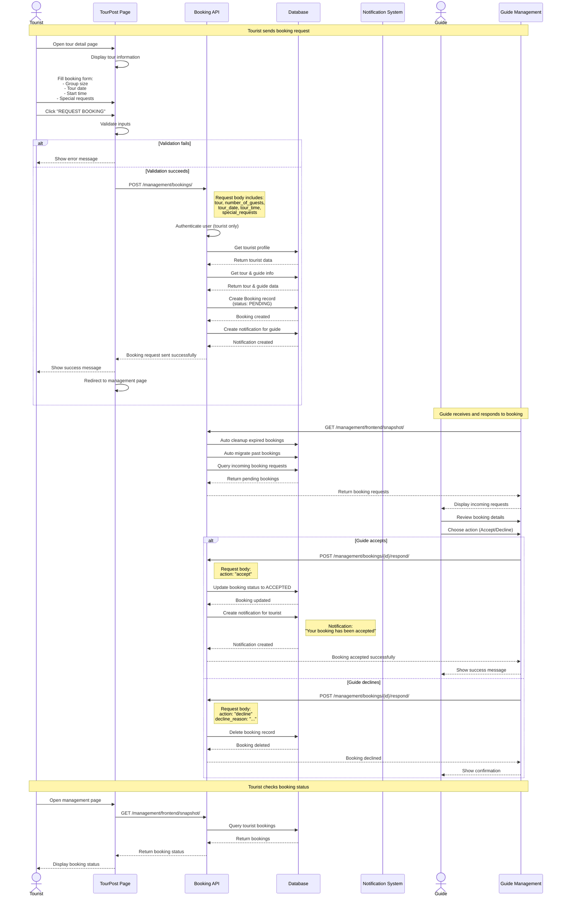
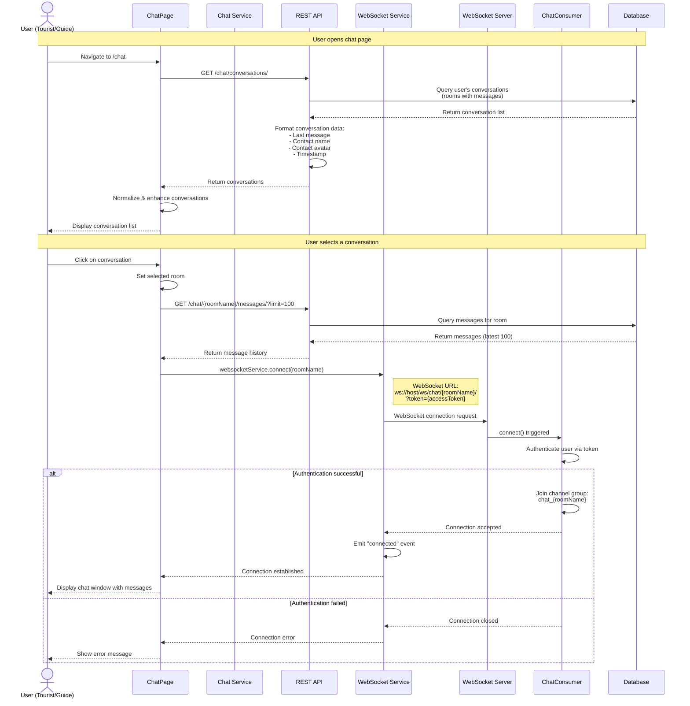
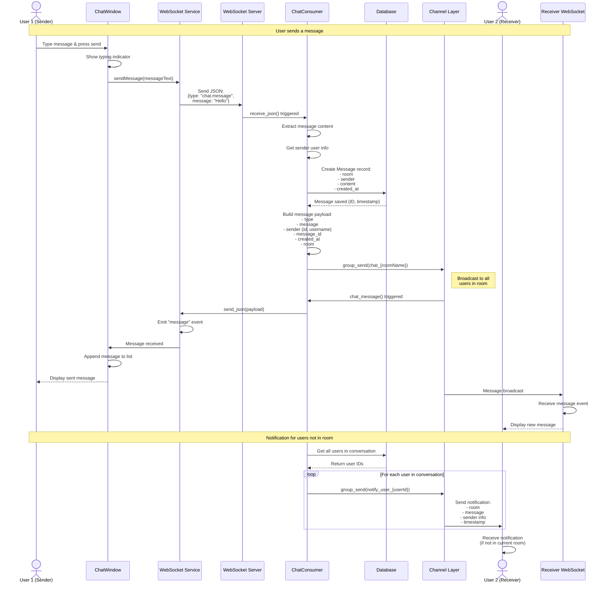
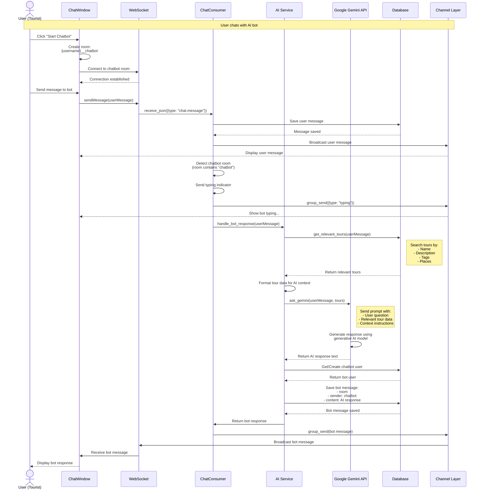

# Sequence Diagrams - VNGO Application

## 1. Search Tour Feature

## 2. Book Tour Feature

## 3. Chat Feature

### 3.1 Chat Initialization & Connection

### 3.2 Sending & Receiving Messages

### 3.3 Chatbot Interaction

## Key Components Explained

### Search Tour

- **Frontend**: `ToursShowPage.jsx` handles UI, filters, and API calls
- **Backend**: `Tour/views.py` contains `get_all_tours()` endpoint with complex filtering
- **Database**: PostgreSQL with Django ORM for querying tours with multiple filters

### Book Tour

- **Frontend**: `TourPost.jsx` for booking form, `ManagementTours.jsx` for viewing bookings
- **Backend**:
  - `Management/views.py` contains booking CRUD operations
  - Automatic cleanup of expired bookings
  - Notification system for guide/tourist communication
- **Flow**: Tourist → Booking Request (PENDING) → Guide Response (ACCEPT/DECLINE)

### Chat

- **Real-time Communication**: Django Channels with WebSocket
- **Frontend**:
  - `ChatPage.jsx` manages conversations
  - `ChatWindow.jsx` handles message display and sending
  - `websocketService.js` manages WebSocket connections
- **Backend**:
  - `Chat/consumers.py` contains `ChatConsumer` for WebSocket handling
  - `Chat/views.py` for REST API (conversation list, message history)
  - `Chat/ai_service.py` for chatbot AI integration
- **Features**:
  - Real-time messaging
  - Typing indicators
  - Message persistence
  - AI chatbot with tour recommendations
