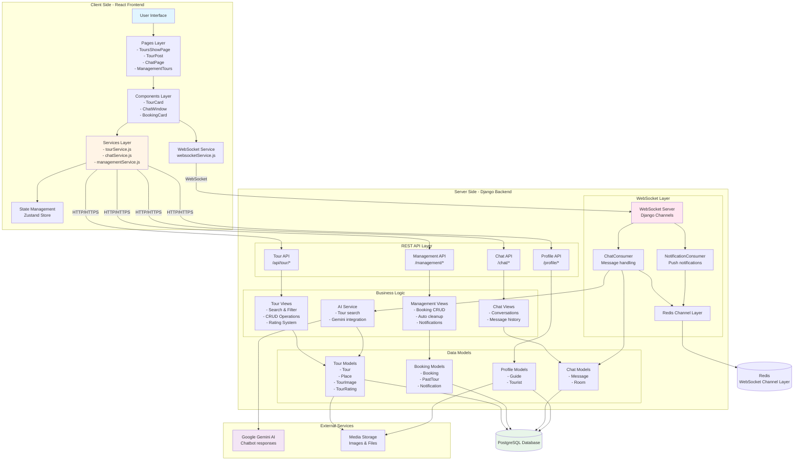
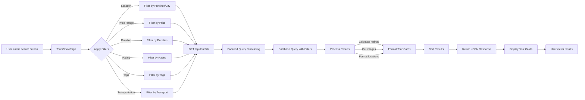
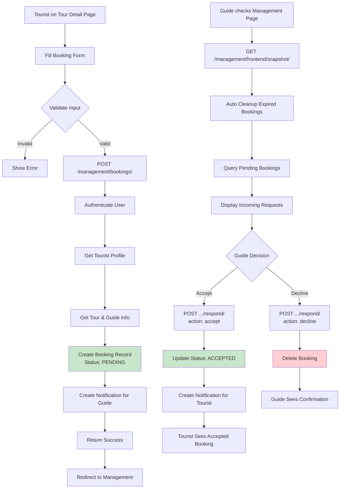
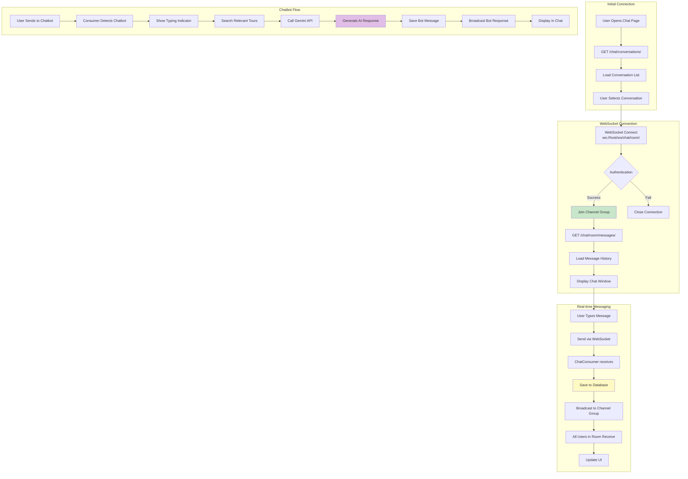

# VNGO System Architecture

## Overall System Architecture

## Data Flow for Each Feature

### 1. Search Tour Data Flow

### 2. Book Tour Data Flow

### 3. Chat Data Flow

## Technology Stack

### Frontend

- **Framework**: React 18 with Vite
- **UI Library**:
  - shadcn/ui components
  - Tailwind CSS for styling
  - Lucide icons
- **State Management**: Zustand
- **HTTP Client**: Axios with interceptors
- **WebSocket**: Native WebSocket API
- **Routing**: React Router v6

### Backend

- **Framework**: Django 4.x
- **API**: Django REST Framework
- **WebSocket**: Django Channels
- **Authentication**: JWT (JSON Web Tokens)
- **AI Integration**: Google Gemini API
- **Task Queue**: Celery (for background tasks)

### Database & Storage

- **Primary Database**: PostgreSQL
- **Cache & Channel Layer**: Redis
- **File Storage**: Django Media Storage
- **ORM**: Django ORM

### Infrastructure

- **Web Server**: Daphne (ASGI server for Django Channels)
- **Reverse Proxy**: Nginx (production)
- **Deployment**: Docker containers

## Security Features

1. **Authentication**

   - JWT-based authentication
   - Token refresh mechanism
   - Protected routes on frontend
   - Permission classes on backend

2. **WebSocket Security**

   - Token-based WS authentication
   - User verification per message
   - Channel group isolation

3. **Data Validation**
   - Frontend form validation
   - Backend serializer validation
   - SQL injection prevention (ORM)
   - XSS protection

## Performance Optimizations

1. **Database**

   - Indexed fields (foreign keys, search fields)
   - Query optimization with select_related/prefetch_related
   - Database connection pooling

2. **Frontend**

   - Code splitting
   - Lazy loading components
   - Image optimization
   - Memoization (useMemo, useCallback)

3. **WebSocket**

   - Redis channel layer for scaling
   - Connection pooling
   - Automatic reconnection

4. **Caching**
   - Redis cache for frequently accessed data
   - Browser cache for static assets
   - API response caching
